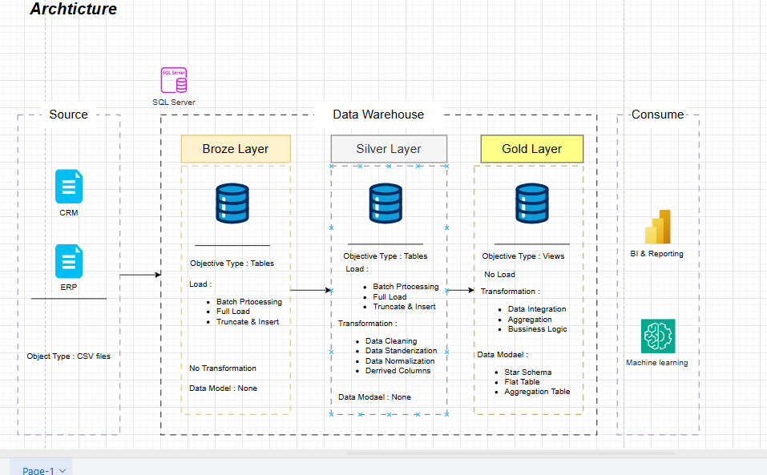

# 🚀 SQL Data Warehouse & Analytics Project

> *Welcome to my comprehensive data warehouse portfolio project — a hands-on demonstration of end-to-end data engineering and analytics workflows using SQL Server. Built with industry best practices, this project bridges raw data ingestion to actionable business intelligence, showcasing both technical depth and strategic insight.*

---

## 📋 Project Requirements

This project is structured to reflect real-world enterprise data pipelines, divided into two core domains: **Data Engineering** and **Data Analysis**. Each stage serves a distinct purpose, ensuring scalability, maintainability, and business value.

---

### 🔧 Building the Data Warehouse (Data Engineering)

#### 🎯 Objective
To design and implement a robust, scalable, and well-documented SQL Server-based data warehouse that ingests, transforms, and models data from heterogeneous sources (CRM & ERP), enabling downstream analytics and reporting for business stakeholders.

#### 📐 Specifications

- **Data Sources**:  
  - Two source systems: `CRM` and `ERP`, each providing structured CSV files.  
  - Files are loaded directly into the Bronze layer without transformation.

- **Data Quality**:  
  - Cleanse and resolve data quality issues (e.g., nulls, duplicates, inconsistent formats) during Silver layer processing.  
  - Implement data validation rules and logging for auditability.

- **Integration**:  
  - Combine CRM and ERP datasets into a unified, user-friendly dimensional model in the Gold layer.  
  - Apply star schema design with fact and dimension tables for optimized querying.

- **Scope**:  
  - Focus on the latest dataset only — historical versioning is not required.  
  - All ETL processes are batch-driven, with full-load and truncate-insert patterns.

- **Documentation**:  
  - Clear documentation of the data model, including entity relationships, column definitions, and transformation logic.  
  - Schema diagrams and process flowcharts provided for stakeholder clarity.

---

### 📊 Generating Business Insights (Data Analysis)

#### 🎯 Objective
To extract, visualize, and communicate meaningful business insights from the curated data warehouse, empowering decision-makers through intuitive dashboards and analytical reports built on the Gold layer.

#### 📈 Visualization & Reporting

- **Tools**:  
  - Power BI / Tableau (or SQL-based reporting via SSRS) for dynamic dashboards.  
  - Custom SQL queries for ad-hoc analysis and KPI tracking.

- **Key Metrics & Dimensions**:  
  - Sales performance by region, product, and time period.  
  - Customer segmentation and retention trends.  
  - Operational efficiency metrics from ERP data.

- **Modeling Strategy**:  
  - Star Schema with `Fact_Sales`, `Dim_Customer`, `Dim_Product`, `Dim_Date`.  
  - Aggregation tables for pre-calculated KPIs to improve query performance.  
  - Views in the Gold layer expose clean, business-ready data for consumption.

- **Output**:  
  - Interactive dashboards for executives and analysts.  
  - PDF/PowerPoint summaries for monthly business reviews.  
  - Machine learning-ready datasets for future predictive modeling.

---

## 🏗️ Architecture Overview

> *Three-tiered architecture — Bronze → Silver → Gold — with source systems feeding into SQL Server, and outputs consumed by BI tools and ML platforms.*

### 🟤 Bronze Layer
- **Objective Type**: Tables  
- **Load**: Batch Processing, Full Load, Truncate & Insert  
- **Transformation**: None  
- **Data Model**: Raw, unstructured — mirrors source CSV format  

### ⚪ Silver Layer
- **Objective Type**: Tables  
- **Load**: Batch Processing, Full Load, Truncate & Insert  
- **Transformation**:  
  - Data Cleaning  
  - Data Standardization  
  - Data Normalization  
  - Derived Columns  
- **Data Model**: None — intermediate staging area  

### 🟡 Gold Layer
- **Objective Type**: Views  
- **Load**: No Load — derived from Silver  
- **Transformation**:  
  - Data Integration  
  - Aggregation  
  - Business Logic  
- **Data Model**:  
  - Star Schema  
  - Flat Table  
  - Aggregation Table  
- **Consumption**: BI & Reporting, Machine Learning  

---

## 👤 About Me

I’m a passionate data professional with a strong foundation in **data engineering, SQL development, and business analytics**. This project reflects my ability to:

✅ Design scalable data architectures  
✅ Execute complex ETL pipelines in SQL Server  
✅ Translate raw data into business-ready insights  
✅ Collaborate across teams with clear documentation and visualization  

Whether you’re looking for someone who can build the pipeline or derive the insights — I bring both to the table. Let’s connect if you need a detail-oriented, results-driven data specialist to elevate your team’s data capabilities.

📩 *Contact me via [LinkedIn](https://www.linkedin.com/in/mohamed-ayman-data/) or GitHub — I’d love to discuss how I can contribute to your next data initiative.*

---
